## Project Overview
**HearDrop** is a console-based donation matching system aimed at connecting donors with recipients. This project aligns with two Sustainable Development Goals:
- **SDG 2: Zero Hunger** 🥗
- **SDG 12: Responsible Consumption and Production** ♻️

The system simplifies the donation process, ensuring efficient distribution of resources and minimizing waste.

---
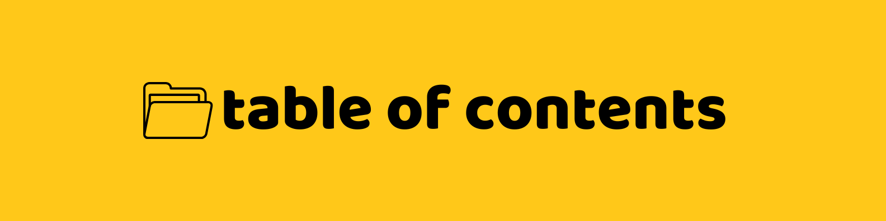
## Table of Contents 📚
1. [Features](#features)
   - [Donor Features](#donor-features)
   - [Recipient Features](#recipient-features)
2. [How It Works](#how-it-works)
   - [User Registration](#step-1-user-registration)
   - [User Login](#step-2-user-login)
   - [Donor Workflow](#step-3-donor-workflow)
   - [Recipient Workflow](#step-4-recipient-workflow)
   - [Database Management](#step-5-database-management)
   - [Status Updates](#step-6-status-updates)
3. [Database Integration and Operations](#database-integration-and-operations)
   - [Database Configuration](#database-configuration)
   - [Connection Setup](#connection-setup)
   - [CRUD Functions](#crud-functions)
   - [Abstraction](#abstraction)
4. [Setup Instructions](#setup-instructions)
   - [Prerequisites](#prerequisites)
   - [Installation](#installation)
5. [System Modules](#system-modules)
   - [System Directory Structure](#system-directory-structure)
   - [Directory Explanation](#directory-explanation)
   - [Classes](#classes)
6. [SDG Implementation](#sdg-implementation)
7. [Tech Used](#tech-used)
8. [About the Developer](#about-the-developer)
9. [Back to Top](#project-overview)

---
## Features 


### Donor Features 
| **Feature**           | **Description**                                                                 |
|-----------------------|---------------------------------------------------------------------------------|
| **Donate Item**          | Add donation details such as item name, description, quantity, and pickup location. |
| **View My Donated Items** | See a list of your donations and their statuses.                                |
| **Edit Donated Items**    | Update item details or pickup locations.                                        |
| **Remove Donated Items**  | Remove your donations (can only be used if the donation status is still available). |


### Recipient Features 
| **Feature**            | **Description**                                                                 |
|------------------------|---------------------------------------------------------------------------------|
| **View Available Donations** | Browse donations listed by donors that are still available to be reserved or claimed. |
| **Reserve Item**          | Reserve an item with a specified pickup time.                                  |
| **View My Reserved Items** | Track reserved items and their pickup details.                                 |
| **Remove My Reserved Items** | Remove your reserved donations from your reservation list; the items will be updated as available again. |

[Back to Top](#project-overview)

---
## How It Works 


### Step 1: User Registration  
- Users register to the system with a unique username and a password.

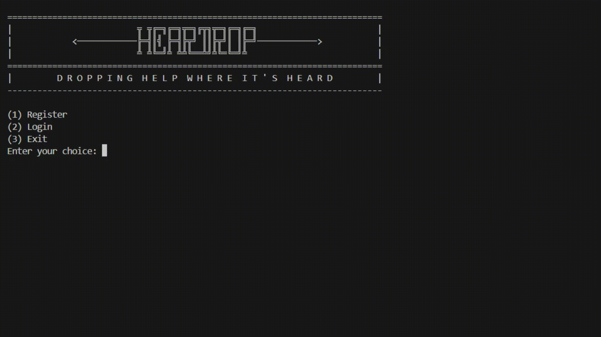

### Step 2: User Login  
- Users log in with their registered credentials, then selecting their role as: **Donor** or **Recipient**.


### Step 3: Donor Workflow  
1. **Add Donation**: Donors provide item details (e.g., name, description, quantity, and pickup location).

  

2. **View Donations**: Track all donated items and their statuses (available, reserved, etc.).

   

3. **Edit Donations**: Modify item details or update pickup location.

 

4. **Remove Donations**: Remove donated items as long as they are available.

 

### Step 4: Recipient Workflow  
1. **View Donations**: Recipients browse available donations.

 

2. **Reserve Items**: Reserve an item and specify a pickup time.

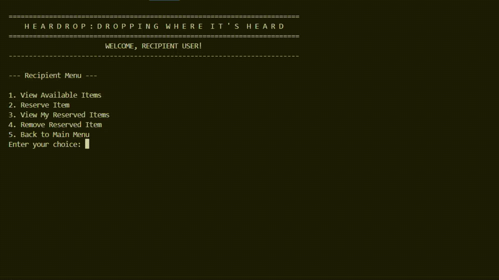 

3. **Track Reservations**: View reserved items and their pickup details.

 

4. **Remove Reservations**: Remove reserved items.

 

### Step 5: Database Management  
- All user and donation data are stored in MySQL tables, ensuring persistence and integrity.

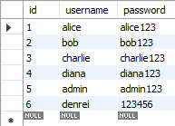

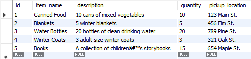

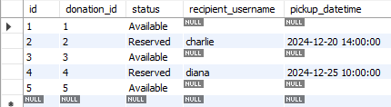

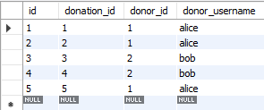


### Step 6: Status Updates  
- Reserved items are marked with the recipient's username and pickup schedule.  
- Donors can view the updated status of their donations.

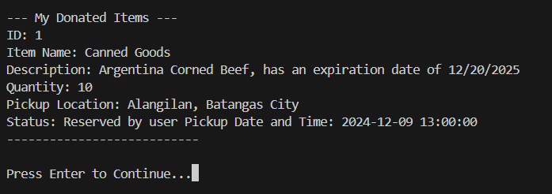

[Back to Top](#project-overview)

---
## Database Integration and Operations 
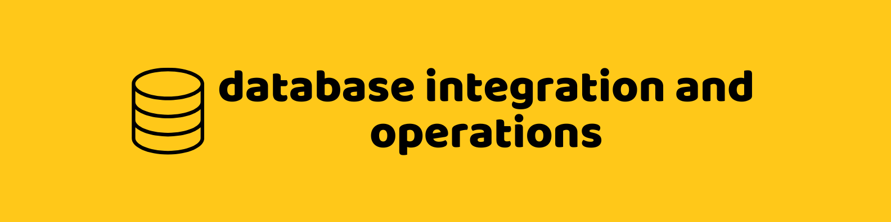

### Database Configuration
The application uses a MySQL database to store user data, donated items, and reservation details. The database connection is established using the JDBC API.

### Connection Setup

The database connection is managed in the `HearDropDB` class. A sample code snippet for establishing the connection is provided below:
``` java
public class HearDropDB {
    private static final String URL = "jdbc:mysql://localhost:3306/";
    private static final String DBNAME = "HearDrop";
    private static String USER = "root";
    private static String PASSWORD = "password";
    private static final String INIT_FILE = "C:\\Users\\denre\\OneDrive\\Desktop\\HearDrop\\src\\init.sql";

    public static Connection getConnection() {
        try {
            return attemptConnection(URL + DBNAME, USER, PASSWORD);
        }
```
Ensure the database server is running, and the credentials match your local setup.

### CRUD Functions
The CRUD functions are encased on the dao package where it contains the `BaseDAO` class that contains the basic CRUD operations, the `DonationDAO` and the `UserDAO`.
1. **Create**
- **Adding Users**: During registration, user details are inserted into the `Users` table.
- **Adding Donations**: Donors add items to the `Donation` table, including a description, pickup location, and availability status.
```java
public boolean addDonation(Donation donation) {
    String donationQuery = "INSERT INTO Donation (item_name, description, quantity, pickup_location) " +
                            "VALUES (?, ?, ?, ?)";
    String donorQuery = "INSERT INTO Donor (donation_id, donor_id, donor_username) " +
                        "VALUES (?, ?, ?)";
    String statusQuery = "INSERT INTO DonationStatus (donation_id, status) VALUES (?, ?)";

    try {
        boolean donationAdded = add(donationQuery, donation.getItemName(), donation.getDescription(), donation.getQuantity(), donation.getPickupLocation());
        if (donationAdded) {
            int donationId = getLastInsertId();
            boolean donorAdded = add(donorQuery, donationId, donation.getDonorId(), donation.getDonorUsername());
            boolean statusAdded = add(statusQuery, donationId, donation.getStatus());
            return donorAdded && statusAdded;
        }
    } catch (SQLException e) {
        e.printStackTrace();
    }
    return false;
}
```
2. **Read**
- **View Donations**: Fetches all available donations from the `Donations` table.
- **View Reserved Items**: Retrieves items reserved by a specific recipient.
```java
    public List<Donation> getAvailableDonations() {
        String query = "SELECT d.id, d.item_name, d.description, d.quantity, d.pickup_location, " +
                       "don.donor_id, don.donor_username, " +
                       "ds.status, ds.recipient_username, ds.pickup_datetime " +
                       "FROM Donation d " +
                       "JOIN Donor don ON d.id = don.donation_id " +
                       "JOIN DonationStatus ds ON d.id = ds.donation_id " +
                       "WHERE ds.status = 'Available'";
        return getList(query, Donation.class);
    }
```
3. **Update**
- **Edit Donated Items**: Updates donation details based on donor input.
```java
public boolean updateDonation(Donation donation) {
    String donationQuery = "UPDATE Donation SET item_name = ?, description = ?, quantity = ?, pickup_location = ? " +
                            "WHERE id = ?";
    String donorQuery = "UPDATE Donor SET donor_id = ?, donor_username = ? WHERE donation_id = ?";
    String statusQuery = "UPDATE DonationStatus SET status = ?, recipient_username = ?, pickup_datetime = ? " +
                            "WHERE donation_id = ?";

    boolean donationUpdated = update(donationQuery, donation.getItemName(), donation.getDescription(), 
                                        donation.getQuantity(), donation.getPickupLocation(), donation.getId());

    boolean donorUpdated = update(donorQuery, donation.getDonorId(), donation.getDonorUsername(), donation.getId());

    boolean statusUpdated = update(statusQuery, donation.getStatus(), donation.getRecipientUsername(), 
                                    Timestamp.valueOf(donation.getPickupDatetime()), donation.getId());

    return donationUpdated && donorUpdated && statusUpdated;
}
```

4. **Delete**
- **Remove Donated Items**: Deletes donated items from the `donation` table.
```java
    public boolean removeDonation(int id) {
        String query = "DELETE FROM Donation WHERE id = ?";
        return remove(query, id);
    }
}
```

[Back to Top](#project-overview)

---
## Setup Instructions 


### Prerequisites
You must have downloaded and has set-up the following in order to continue:
- Java Development Kit (JDK)
- MySQL Server and JDBC (Java Connector)
- IDE or Terminal (Visual Studio Code)
- Git (optional)
- Github Account (optional)

### Installation
1. Clone the repository:
   - **Option 1**: (Git and a Github Account required.)
        - Launch VS Code and open the command palette. Press `Ctrl+Shift+P`(Windows) or `Command+shift+P` (Mac) to open it.
        - Type `Git: Clone` in the command palette and select it from the list of suggestions
        - Copy and paste the following then hit `Enter`:
            ```bash
            https://github.com/DenreiAngeles/HearDrop_DBMS.git
            ```
        - Select the destination of where you want to clone the repository.
        - Open the cloned repository.
          
   - **Option 2**:
        - Navigate through the repository and download the `zip file`
        - Extract the `folder` inside the `zip file` then open it in your IDE.
2. Navigate to the project directory:
   - Make sure to add the **mysql connector for java** on the **referenced libraries**.
   - Dropdown `src` from the explorer and find and dropdown the `Database` package. (Optional but highly advised)
   - Click on `HearDropDB.java` and update to your MySQL credentials of `USER` and `PASSWORD`. (Optional but highly advised)
   - Modify the `INIT_FILE` to the directory of the init.sql on your device. **(REQUIRED)**
   - Find and dropdown `Main` package.
3. Compile and run the program:
   - Click `Main.java`, then compile and run it.

---
## System Modules 
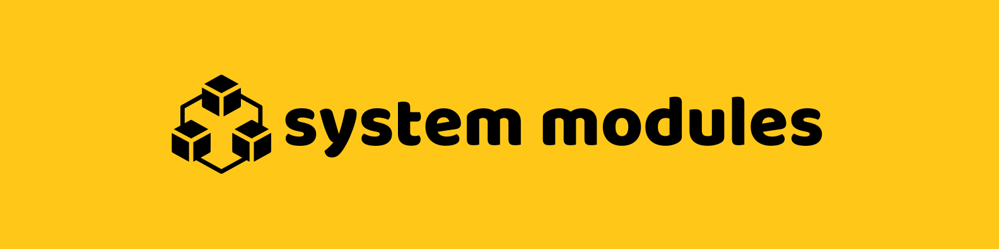
### System Directory Structure
```plaintext
├── src/
|   ├── dao/
|   |   ├── BaseDAO.java
|   |   ├── DonationDAO.java
|   |   └── UserDAO.java
|   |
|   ├── db/
|   |   └── HearDropDB.java
|   |   └── init.sql
|   |   └── schema.png
|   |
|   ├── main/
|   |   └── Main.java
|   |
|   ├── menus/
|   |   ├── BaseMenu.java
|   |   ├── DonorMenu.java
|   |   └── RecipientMenu.java
|   |
|   ├── models/
|   |   ├── User.java
|   |   └── Donation.java
|   |
|   ├── service/
|   |   ├── DonationService.java
|   |   ├── RecipientService.java
|   |   └── UserService.java
|   |
|   └── utils/
|       ├── DesignUtils.java
|       └── LogUtils.java
|
```
This project contains seven (7) packages and fifteen (15) modules all working together to run the system.
### Directory Explanation
- **DAO (Data Access Object)** -
    Contains data access objects for handling database operations related to `User` and `Donation`. The `BaseDAO` provides common CRUD (Create, Read, Update, Delete) functionalities.

- **DB** -
    Houses the `HearDropDB` class for database connection and setup.

- **Main** -
    Includes the entry point of the program `Main.java`.

- **Menus** -
    Contains classes for user interface logic tailored to roles such as `DonorMenu` and `RecipientMenu` modeled with `BaseMenu`.

- **Models** -
    Represents entities such as `User` and `Donation`.

- **Service** -
    Provides business logic, such as handling donations (`DonationService`), recipient operations (`RecipientService`) and user operations (`UserService`).

- **Utils** -
    Contains utility classes like `DesignUtils` for formatting and `LogUtils` for error logging.

### Classes 

| **Class**           | **Package**  | **Description**                                                                                                                                                                                                 |
|----------------------|--------------|-----------------------------------------------------------------------------------------------------------------------------------------------------------------------------------------------------------------|
| `BaseDAO`         | DAO          | Abstract class that provides reusable CRUD operations (`add`, `getById`, `getList`, `update`, `remove`). Subclasses implement `mapResultSetToObject` to define how to map database results to specific objects. |
| `DonationDAO`        | DAO          | Extends `BaseDAO` to handle operations specific to `Donation` objects, such as retrieving donations by donor or recipient and updating donation details.                                                       |
| `UserDAO`            | DAO          | Extends `BaseDAO` to manage operations related to `User`, such as user registration, login, and retrieving user details.                                                                                      |
| `HearDropDB`         | DB     | Provides a singleton database connection for all `DAO` classes to interact with the database.                                                                                                                   |
| `Donation`           | Models       | Represents a donation item, including its details like `item_name`, `quantity`, `pickup_location`, `status`, and donor/recipient information.                                                                |
| `User`               | Models       | Represents a user in the system with attributes like `id`, `username`, and `password`.                                                                                                                        |
| `BaseMenu`           | Menus        | Abstract class for menu interfaces. Defines a structure for displaying menus, handling user choices, and managing menu navigation.                                                                             |
| `DonorMenu`          | Menus        | Extends `BaseMenu` to provide a menu interface for donors, including options to `donate items`, `view donations`, `edit donations`, and `remove items`.                                                               |
| `RecipientMenu`      | Menus        | Extends `BaseMenu` to provide a menu interface for recipients, including options to `view available items`, `reserve items`, and `manage their reservations`.                                                        |
| `DesignUtils`        | Utils        | Provides utility methods for styling and formatting console output, such as headers and dividers.                                                                                                              |
| `LogUtils`           | Utils        | Provides utility methods for logging errors and information to a file.                                                                                                                                         |
| `Main`               | Main         | Entry point of the application. Handles user authentication and role-based menu redirection (donor or recipient).                                                                                              |
| `DonationService`    | Service      | Contains business logic for managing donations, such as creating, updating, and deleting donations, using `DonationDAO`.                                                                                       |
| `UserService`        | Service      | Handles user-related business logic, such as registration, login validation, and retrieving user details, using `UserDAO`.                                                                                     |
| `RecipientService`   | Service      | Contains business logic for managing recipient-related actions, such as reserving items, viewing available donations, and managing reservations, using `DonationDAO`.                                          |

[Back to Top](#project-overview)

---
## SDG Implementation 


### This project focuses on two key Sustainable Development Goals (SDGs):

1. **Zero Hunger (SDG 2)**: 
   - **Facilitates Equitable Distribution**: HearDrop helps bridge the gap between donors and recipients, ensuring that food and essential resources are distributed to those who need them most, thus contributing to the eradication of hunger.
   - **Community Support**: By creating a platform for resource sharing, it empowers communities to support each other, enhancing food security and reducing hunger in vulnerable populations.
   - **Local Engagement**: Encourages local involvement and volunteerism, fostering a sense of community and collective effort towards ending hunger.

2. **Responsible Consumption and Production (SDG 12)**: 
   - **Minimizes Waste**: HearDrop promotes the efficient use of resources by redirecting surplus food and goods from donors to recipients, thus minimizing waste and promoting sustainability.
   - **Encourages Sustainable Practices**: By facilitating the donation and reuse of items, it supports sustainable consumption patterns, reducing the environmental impact of waste.
   - **Resource Optimization**: Helps optimize the use of available resources, ensuring that useful items are not discarded but instead serve to meet the needs of others.

### How HearDrop Achieves These Goals:

- **User-Friendly Platform**: Provides an intuitive and accessible platform for users to donate and receive items easily, ensuring that the process of sharing resources is seamless and efficient.
- **Tracking and Reporting**: Implements tracking of donations and their impact, allowing users to see the tangible benefits of their contributions and encouraging more consistent and meaningful participation.
- **Educational Outreach**: Raises awareness about the importance of zero hunger and responsible consumption through educational materials and community engagement, fostering a culture of sustainability and empathy.

[Back to Top](#project-overview)

---
## Tech Used 


- **Programming Language**: Java ☕
- **Database Management System**: MySQL 🛢️🐬
- **Utilities**: JDBC (Java Database Connectivity) 🔗

[Back to Top](#project-overview)

---

## About the Developer
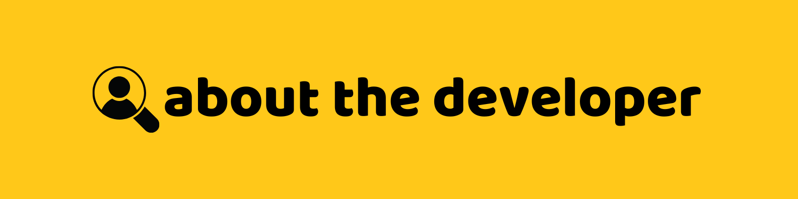

Hey there! I'm **Denrei**, the sole developer behind HearDrop. 
Contact me here:
Email: 23-06835@g.batstate-u.edu.ph
Github: https://github.com/DenreiAngeles


[Back to Top](#project-overview)

